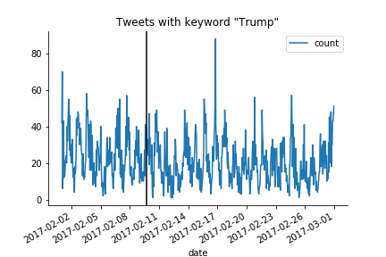
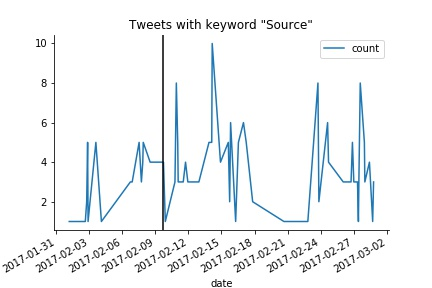
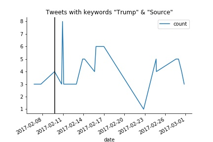
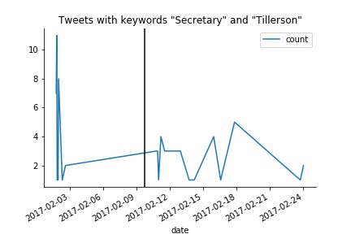

### William Cassidy and Walter Zhang

RCC Deep Learning Hackathon 



## Time series plots of tweets by keyword

### Tweets that have both "Trump" and "Source" keywords on February 10th

| Date | Text |
| :--- | :--: |
| 2017-02-10 22:00:00 | trump won't immediately appeal travel ban bloc... |
| 2017-02-10 22:00:00 | trump dumped tillerson's deputy secretary of s... |
| 2017-02-10 22:00:00 | trump won't immediately appeal travel ban bloc... |
| 2017-02-10 19:00:00 | trump dumped tillerson's deputy secretary of s... |
| 2017-02-10 22:00:00 | trump won't immediately appeal travel ban bloc... |
| 2017-02-10 22:00:00 | trump dumped tillerson's deputy secretary of s... |
| 2017-02-10 22:00:00 | trump won't immediately appeal travel ban bloc... |
| 2017-02-10 19:00:00 | trump dumped tillerson's deputy secretary of s... |
| 2017-02-10 22:00:00 | trump won't immediately appeal travel ban bloc... |
| 2017-02-10 22:00:00 | trump dumped tillerson's deputy secretary of s... |
| 2017-02-10 19:00:00 | trump dumped tillerson's deputy secretary of s... |
